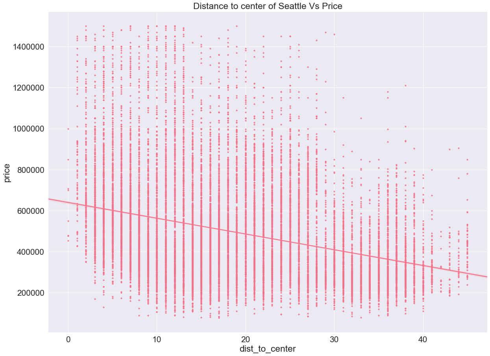
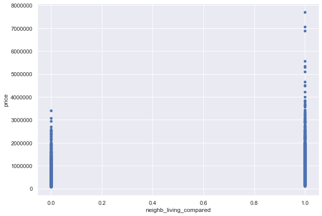

# Table of contents

- Purpose

- Synopsis

- Analysis

- Wayforward

# Purpose

Given housing data for Kings County Seattle, to find price predictors and create a linear regression model capable of predicting potential prices for new homes. This README will also serve as a general outline and explanation of the analysis and development process.


# Synopsis

An exploration into distances did find some interesting trends that warrant further investigation and after numerous tried and failed attempts I settled on standard feature selection model that produced an R-squared of 0.84 and a root mean squared error of $98k. I incorporated the the distance to the center of the city as a feature changed the sqft_basement feature to a categorical feature - 0 for hasn't, 1 for has.

# Analysis

## Baseline model

After an initial clean of the data I proceeded to create a baseline model that gave a place to start by having a prediction model that give an idea of how well a linear regression works with minimal changes to the data.

This baseline model produced  an R-squared of 0.69 and root MSE of ~$200k


## Model 2

With model two I added the distance to the center of Seattle (I use the iconic Space Needle's longitude and latitude)
and also added a new binary feature that tells us whether the house is larger or smaller than the average of the neighbours.

'''python

    def haversine_distance(lat1, lon1):
        # log, lat of the Seattle Space Needle, location i used to reference the center of seattle
        lat2 = 47.620422
        lon2 = -122.349358
        r = 6371
        phi1 = np.radians(lat1)
        phi2 = np.radians(lat2)
        delta_phi = np.radians(lat2 - lat1)
        delta_lambda = np.radians(lon2 - lon1)
        a = np.sin(delta_phi / 2)**2 + np.cos(phi1) * np.cos(phi2) *   np.sin(delta_lambda / 2)**2
        res = r * (2 * np.arctan2(np.sqrt(a), np.sqrt(1 - a)))
        return np.round(res, 2)

    df_dist = df_compared.copy()
    df_dist['dist_to_center'] = 0
    for index, row in df_dist.iterrows():
    df_dist['dist_to_center'][index] = haversine_distance(row['lat'], row['long'])
'''




Histogram of comparison of house lot size vs neighbours:




Model 2 resulted in a reduced error rate and better R-squared: 0.83, $154k root MSE.

## Model 3 - Final

The final model removed outliers and by testing two models that had differed in how aggressive they were in removing outliers.
The first only had homes up to 1.5M and also removed homes from a further distance (94% of homes), this gave a similar R-squared of 0.84 but the root MSE improved by quite abit - down to $98k

The second more aggressive dataset had more outliers removed, with it containing homes only up to 1M and also removing homes from closer (89% of homes). This gave a R-squared of 0.83 and and root MSE of $88k

I settled for the dataset and model that covered 94% of homes up to the value of 1.5M

# Way forward

- Increase the dataset to close existing holes/gaps

- Scraping additional data on areas and business of interest to house purchasers. Information such as schools, restaurants, historical and recreational places near homes may affect the price of the house

- Apply more advanced methods of analysis - e.g machine learning on larger sets of data

- Further analysis on more niche houses that normally would be considered outliers.

- Deploy model for potential hosts to use.


```python

```
